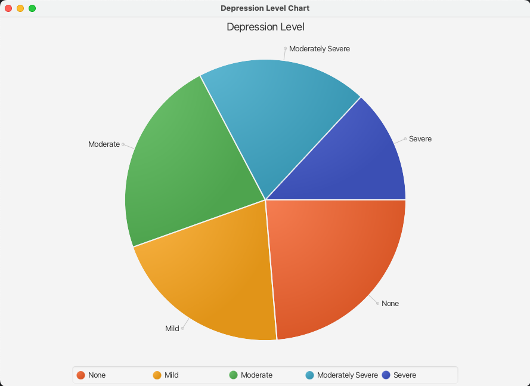
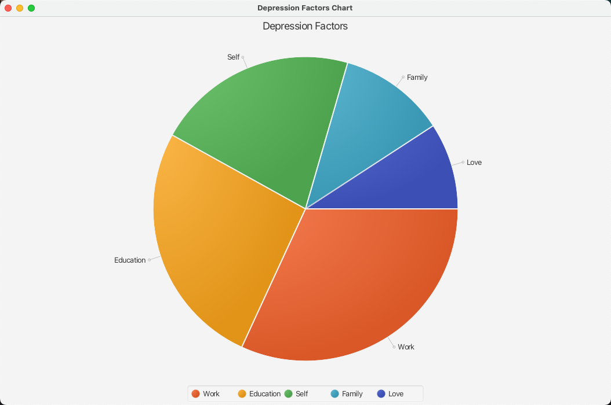

<div id="top" align="center">
</div>
<!-- PROJECT LOGO -->
<div align="center">
<h1 align="center">Data Mining Project</h1>
  <h3 align="center">
    Applying data mining techniques to predict the depression level of Vietnamese students
    <br />
    <br />
    <a href="https://github.com/GiaKhanhs/DM_Project/issues">Report Bug</a>
    ·
    <a href="https://github.com/GiaKhanhs/DM_Project/issues">Request Feature</a>
  </h3>

[![Contributors][contributors-shield]][contributors-url]
[![Forks][forks-shield]][forks-url]
[![Issues][issues-shield]][issues-url]

</div>

# ABOUT

## 1. The team behind it

| No. |       Full Name        | Student's ID |              Email               |                  Github account                   |                               Roles                                | Contribution |
| :-: | :--------------------: | :----------: | :------------------------------: | :-----------------------------------------------: | :----------------------------------------------------------------: | :----------: |
|  1  |  Nguyen Hoang Anh Tu   | ITDSIU20090  | ITDSIU20090@student.hcmiu.edu.vn |     [nghganhtu](https://github.com/nghganhtu)     |   **TEAM LEADER** with Model evaluation, Hyper-parameters tuning   |     20%      |
|  2  |   Nguyen Quang Dieu    | ITDSIU20031  | ITDSIU20031@student.hcmiu.edu.vn |    [itzmealvin](https://github.com/itzmealvin)    |              Data preprocessing, Optimize performance              |     20%      |
|  3  | Duong Nguyen Gia Khanh | ITDSIU20100  | ITDSIU20100@student.hcmiu.edu.vn |     [GiaKhanhs](https://github.com/GiaKhanhs)     | Implement classification/prediction algorithms in Java, Bug fixing |     20%      |
|  4  |    Hoang Tuan Kiet     | ITDSIU21055  | ITDSIU21055@student.hcmiu.edu.vn |      [meiskiet](https://github.com/meiskiet)      |          Implement pre-processing code, Workspace set-up           |     20%      |
|  5  |    Nguyen Hai Ngoc     | ITDSIU21057  | ITDSIU21057@student.hcmiu.edu.vn | [haingocnguyen](https://github.com/haingocnguyen) | Implement classification/prediction algorithms in Java, Bug fixing |     20%      |

## 2. The project we are working on

The project investigates depression in Vietnamese teenagers aged 15-25 using modern data mining methods, highlighting
the need for culturally sensitive early detection strategies to reduce mental health issues.

## 3. Goal

- Use machine learning models to accurately predict depression levels among Vietnamese students.
- Tests a range of complex machine learning model approaches to identify the most successful ones.
- Increase the endurance and effectiveness of these classification models by including more potent algorithms.
- Apply data mining techniques to real-world datasets to bridge the gap between theoretical research and practical
  application.
- Empower healthcare practitioners to make more informed clinical decisions and enhance the mental health of Vietnamese
  students through early detection and intervention.

# REASON

## 1. Motivation

Depression awareness in Vietnam has increased due to the Internet, but the public's willingness to seek screenings
remains low. Self-assessment programs like "15minutes4me" offer hope, but they often rely on predetermined symptoms,
overlooking the complex interplay between living environment and stress. This data mining project aims to predict
depression levels among Vietnamese students aged 15 to 25 by investigating environmental factors and pressures. Building
on prior research, the study uses a classification model and analytic techniques to provide a more nuanced understanding
of depression among Vietnamese students.

## 2. Idea

Using machine learning model built on top of classification algorithms, to improve prediction accuracy in various
sectors, particularly in measuring depression levels among Vietnamese students. Advanced algorithms like Support Vector
Machine, Naive Bayes, and K-Nearest Neighbors are used to manage large datasets, identify patterns, and make accurate
predictions.

## 3. Roadmap

- [x] Data collecting
- [x] Data pre-processing
- [x] Build model to classify
- [ ] Deploy AI Chatbot based on the result
- [ ] More to come...

Please see the [open issues](https://github.com/GiaKhanhs/DM_Project/issues) for a full list of proposed features (
and known issues).

# METHODOLOGY (based on theory class)

## 1. Ask a question

This study focuses on predicting depression levels among Vietnamese students using data mining techniques. It
investigates the accuracy of machine learning algorithms and their practical implications for early detection and
intervention, aiming to improve students' well-being and academic performance.

## 2. Data gathering

The research used a systematic approach to gather data on stress and pressure among Vietnamese students. A **Google Form**
survey was created based on various studies and conversations with university specialists. The survey identified five
main causes of stress: employment, studies, self, family, and love. The Patient Health Questionnaire (PHQ-9) was used to
assess depression risk. The survey was distributed to a diverse group of Vietnamese students, ensuring confidentiality
and anonymity. The data collected was evaluated for quality and completeness, aiming to improve knowledge and early
detection of depression among Vietnamese students.

## 3. Data cleaning

The pre-processing stage of a depression study involved categorizing responses into five groups based on depression-related factors. Python's'shuffle' function ensured no inherent order or bias. Python was used for data processing due to Weka's limitations and Java's difficulties. Missing data was filled using an imputation method, and string-type responses were converted into numerical form using label encoding. The original dataset had long column names, requiring special encoding for quick access. Questions were encoded with alphabetical letters for clarity. This pre-processing made the dataset suitable for further analysis and machine learning methods.

## 4. Model building

Machine learning algorithms are crucial for creating classification models, as they identify trends and make data-driven judgments. Techniques like ibk, J48, Logistic Regression, Naive Bayes, OneR, SVM, AdaBoostM1, RandomForest, and ExtraTree are used to classify instances based on their closest neighbors, making them suitable for pattern recognition tasks, binary classification, and large datasets. Ensemble approaches like AdaBoostM1 and RandomForest increase classification performance by integrating multiple classifiers, while ExtraTree increases resilience by creating decision trees with random splits. Weka supports these models and offers full modeling and training capabilities, making the development process easier. Weka functions like buildClassifier are often used throughout the model development process, making the training process quick for many classifiers.

## 5. Return the result

The final step involves evaluating a machine learning model on a test dataset to assess its effectiveness in identifying and forecasting depression levels. This evaluation uses measures like accuracy, precision, recall, and F1 score, ensuring the model's dependability, accuracy, and generalization capabilities. This step is crucial for enabling proactive early depression detection and management, enhancing student well-being. The model's efficacy is assessed using functions like toSummaryString, toMatrixString, and metrics, providing comprehensive results for a comprehensive study.

# PROJECT STRUCTURE

- `.idea` folder: provides project-specific parameters and configurations for IntelliJ IDEA
- `.vscode` folder: contains project-specific settings and configuration files for Visual Studio Code
- `data` folder: to hold the datasets organized by family, love, self, study, and job subfolders. Each contains the full training, testing, and validation dataset in both CSV and ARFF format supported by the Weka
- `demo` folder: it comprises screenshots for the UI and results produced in CSV format
- `lib` folder: contains external libraries and dependencies needed for the project (weka.jar, extraTree.jar, and JavaFX SDK)
- `out` folder: stores compiled output files, such as class files
- `src` folder: the primary source directory for the project’s code
  - `model` subfolder:
    - `based_models` subfolder: provides foundational classifier Java classes for this project. That includes IBk, J48, Logistic Regression, Naïve Bayes, OneR, SVM as default, and J48, Logistics Regression, and SVM as tuning models.
    - `ensemble_models` subfolder: contains the ensemble model classes that incorporate many classifiers. That includes AdaBoostM1, ExtraTree, and RandomForest as default and tuning models.
      - These folders further contain the models and hyperparameter_tuning subfolders for each.
    - `Command.java`: the interface for each classifier model class to implement the `void exec(DataSource trainSource, DataSource testSource)` function
  - `pre-processing` folder:
    - `FS_output` folder: contains output files for JavaFX visualization chart
    - `helloFX` folder: contains the source code for a JavaFX application
    - `DataImporter.java`: class to import data from the specified path
    - `DataProcessor.java`: the class for processing and preparing data
    - `FeatureSelection.java`: class to enable feature selection algorithms
    - `RemoveAttributes.java`: a class that has a function for deleting certain features from the datasets
    - `SplitData.java`: the class that separates datasets into training, testing, and validation sets
- `Main.java`: the project driver code and contains the Main class
- `.gitignore`: to allow Git VCS to ignore certain files and folders
- `DM_Project.iml`: to configure the IntelliJ IDEA project file
- `README.md`: a document to outline and explain the project

# INSTALLATION

## Required software

- Java Development Kit 17++ (i.e. OpenJDK) [CLICK TO DOWNLOAD](https://openjdk.org/)
- Any Java IDE (i.e. JetBrains IntelliJ IDEA) [CLICK TO DOWNLOAD](https://www.jetbrains.com/idea/download/)

## Steps

1. Clone the repo
   ```sh
   git clone https://github.com/GiaKhanhs/DM_Project.git
   ```
2. Open in a Java IDE (preferably JetBrains IntelliJ IDEA)
3. Now click on File > Project Structure... > Library. Click on (+) button on point to the `lib` folder, add the
   following libraries:

- `lib/weka.jar` for Weka main library
- `lib/extraTrees.jar` for ExtraTrees library
- `lib/javafx-sdk-osx-arm64/lib` for JavaFX on **Apple Silicon Macs**
  or `lib/javafx-sdk-win64/lib` for JavaFX on **Intel/AMD Windows PC**. For others platform, please refer
  to [here](https://gluonhq.com/products/javafx/) and download `JavaFX v22.0.1` for your platform.

4. Open `src/preprocessing/dataImporter.java` and replace the dataset you want to explore in the **try** block.

   ```java
   // macOS/Unix
   trainSource = new DataSource("data/family/training_data.arff");
   testSource = new DataSource("data/family/test_data.arff");
   validSource = new DataSource("data/family/validation_data.arff");
   // Windows
   trainSource = new DataSource("data\\family\\training_data.arff");
   testSource = new DataSource("data\\family\\test_data.arff");
   validSource = new DataSource("data\\family\\validation_data.arff");
   ```

5. Open `src/Main.java` and click on **RUN** button to see the result
6. To see the visualization, open either `src/preprocessing/helloFX/PieChartAll.java`
   or `src/preprocessing/helloFX/PieChartFactors.java`, then click on Run > Edit Configurations and add the VM like this
   on macOS/Unix
   ```txt
   FOR macOS/Unix: --module-path /absolute/path/to/javafx-sdk-22.0.1/lib --add-modules javafx.controls,javafx.fxml
   FOR Windows:    --module-path "\path\to\javafx-sdk-22.0.1\lib" --add-modules javafx.controls,javafx.fxml
   ```

then click on **Run** to see the result

# RESULT

## Exploratory Data Analysis


The study analyzed data from 1,500 Vietnamese students, with 739 being female and 761 being male. It revealed that
females are more prone to severe depression and have a higher risk of self-harm. Family and work-related stressors were
significant contributors to depression among female students.


Physical activity was associated with lower levels of
depression, and students whose parents spoiled were more prone to develop depression later in life. Academic stress was
a major concern for high school and first-year college students, while graduates and fourth-year college students were
more concerned with employment and finances. The LGBT community also experienced significant stress due to familial and
personal concerns. Workplace stress was a major problem, particularly among females. Academic stress, school bullying,
parental expectations, instructor partiality, and peer pressure were also significant contributors. Romantic
relationships were a major stressor for Vietnamese students, contributing to anxiety and emotional illnesses.
Family-related stress was a major concern, with high parental expectations, mistaken caring, and financial issues.

## Model best parameters

The following table displays the optimal model parameters derived from Weka, a hyperparameter tool that uses ten-fold cross-validation to identify optimal parameter combinations for optimal performance on datasets. The table also provides a clear explanation of the model's performance after tweaking, highlighting the importance of thorough tuning.

| **MODEL**         | **DATASET** | **PARAMETERS**                                                                                                                                                                                                                                              | **DESCRIPTIONS**                                                                                                                                                                                                                                                                                                                                                                                                                                                          |
| ----------------- | ----------- | ----------------------------------------------------------------------------------------------------------------------------------------------------------------------------------------------------------------------------------------------------------- | ------------------------------------------------------------------------------------------------------------------------------------------------------------------------------------------------------------------------------------------------------------------------------------------------------------------------------------------------------------------------------------------------------------------------------------------------------------------------- |
| **SVM**           | family      | -C 0.2222222222222222<br>-C 250007<br>-E 2.0<br>-K weka.classifiers.functions.supportVector.PolyKernel<br>-L 0.001<br>-M -1<br>-N 0<br>-P 1.0E-12<br>-R 1.0E-8<br>-V -1<br>-W 1<br>-calibrator weka.classifiers.functions.Logistic<br>-num-decimal-places 4 | -C: Complexity parameter (C) of the SVM.<br>-E: Exponent for the polynomial kernel.<br>-K: Kernel function for SVM.<br>-L: Learning rate.<br>-M: Margin parameter.<br>-N: Number of folds for cross-validation.<br>-P: Precision parameter.<br>-R: Regularization parameter.<br>-V: Validation threshold.<br>-W: Weight of the instances.<br>-calibrator: Calibrator function for probability estimation.<br>-num-decimal-places: Number of decimal places in the output. |
| **SVM**           | love        | -C 0.3333333333333333<br>-C 250007<br>-E 2.0<br>-K weka.classifiers.functions.supportVector.PolyKernel<br>-L 0.001<br>-M -1<br>-N 0<br>-P 1.0E-12<br>-R 1.0E-8<br>-V -1<br>-W 1<br>-calibrator weka.classifiers.functions.Logistic<br>-num-decimal-places 4 | Already described                                                                                                                                                                                                                                                                                                                                                                                                                                                         |
| **Random Forest** | self        | -I 670<br>-K 0<br>-M 1.0<br>-P 100<br>-S 1<br>-V 0.001<br>-num-slots 1                                                                                                                                                                                      | -I: Number of iterations (trees) in Random Forest.<br>-K: Number of attributes to randomly investigate in each tree node.<br>-M: Margin parameter.<br>-P: Percentage of data to use for training each tree.<br>-S: Random seed for reproducibility.<br>-V: Variance parameter for Random Forest.<br>-num-slots: Number of execution slots (threads) to use.                                                                                                               |
| **SVM**           | study       | -C 0.4444444444444444<br>-C 250007<br>-E 2.0<br>-K weka.classifiers.functions.supportVector.PolyKernel<br>-L 0.001<br>-M -1<br>-N 0<br>-P 1.0E-12<br>-R 1.0E-8<br>-V -1<br>-W 1<br>-calibrator weka.classifiers.functions.Logistic<br>-num-decimal-places 4 | Already described                                                                                                                                                                                                                                                                                                                                                                                                                                                         |
| **Random Forest** | work        | -I 230<br>-K 0<br>-M 1.0<br>-P 100<br>-S 1<br>-V 0.001<br>-num-slots 1                                                                                                                                                                                      | Already described                                                                                                                                                                                                                                                                                                                                                                                                                                                         |

## Model performance

The next three table display machine learning models' accuracy on testing datasets before and after hyperparameter tweaking, followed by validation dataset using Weka on ten-fold cross-validation. Results highlight gains in performance and the best-performing model for each dataset, with bold numbers representing best accuracy.

| **DATASET** | **IBk**     | **Logistics Regression** | **NaiveBayes** | **Random Forest** | **SVM**     |
| ----------- | ----------- | ------------------------ | -------------- | ----------------- | ----------- |
| family      | 70.5882     | 70.5882                  | 52.9412        | 61.7647           | **82.3529** |
| love        | **78.5714** | 53.5714                  | 64.2857        | 64.2857           | 75.0000     |
| self        | 76.5625     | **87.5000**              | **87.5000**    | 79.6875           | 85.9375     |
| study       | 82.2785     | **94.9367**              | 81.0127        | 86.0759           | 87.3418     |
| work        | 79.1667     | **93.7500**              | 83.3333        | 84.3750           | 90.6250     |

| **DATASET** | **IBk** | **Logistics Regression** | **NaiveBayes** | **Random Forest** | **SVM**     |
| ----------- | ------- | ------------------------ | -------------- | ----------------- | ----------- |
| family      | N/A     | 70.5882                  | N/A            | 67.6471           | **88.2353** |
| love        | N/A     | 53.5714                  | N/A            | 64.2857           | **78.5714** |
| self        | N/A     | **89.0625**              | N/A            | 81.2500           | 84.3750     |
| study       | N/A     | **94.9367**              | N/A            | 87.3418           | 93.6709     |
| work        | N/A     | **93.7500**              | N/A            | 85.4167           | 88.5417     |

| **DATASET** | **IBk** | **Logistics Regression** | **NaiveBayes** | **Random Forest** | **SVM**     |
| ----------- | ------- | ------------------------ | -------------- | ----------------- | ----------- |
| family      | N/A     | 74.0741                  | N/A            | **81.4815**       | 77.7778     |
| love        | N/A     | 77.2727                  | N/A            | 72.7273           | **81.8182** |
| self        | N/A     | **94.1146**              | N/A            | 80.3922           | 90.1961     |
| study       | N/A     | 88.8889                  | N/A            | 82.5397           | **88.8889** |
| work        | N/A     | 94.7368                  | N/A            | 85.5263           | **96.0526** |

The full version of the results can be found [here](https://docs.google.com/spreadsheets/d/e/2PACX-1vQVJ0OMRFO8Qe0KiMDKrPRrWlWDz-eZrH04Knn0yB1prtAaX7YmRjkX9ejF5I1U612yqPo2s_PJxKbZ/pubhtml#).

**(and more to explore for you to contribute in our project...)**

<!-- CONTRIBUTING -->

# CONTRIBUTING

Contributions are what make the open source community such an amazing place to learn, inspire, and create. Any
contributions you make are **greatly appreciated**.

If you have a suggestion that would make this better, please fork the repo and create a pull request. You can also
simply open an issue with the tag "enhancement".
Don't forget to give the project a star! Thanks again!

1. Fork the Project
2. Create your Feature Branch (`git checkout -b feature/AmazingFeature`)
3. Commit your Changes (`git commit -m 'Add some AmazingFeature'`)
4. Push to the Branch (`git push origin feature/AmazingFeature`)
5. Open a Pull Request

<!-- CONTACT-->

# CONTACT

Nguyen Hoang Anh Tu by **[Email HERE](mailto:ITDSIU20090@student.hcmiu.edu.vn)**

Project Link: **[GitHub HERE](https://github.com/GiaKhanhs/DM_Project/issues)**

<!-- ACKNOWLEDGMENTS -->

# ACKNOWLEDGEMENTS

We want to express our sincerest thanks to our lecturer and the people who have helped us to achieve this project's
goals:

- []() Dr. Nguyen Thi Thanh Sang
- []() MSc. Nguyen Quang Phu
- []() The README.md template from **[othneildrew](https://github.com/othneildrew/Best-README-Template)**

<!-- MARKDOWN LINKS & IMAGES -->

[contributors-shield]: https://img.shields.io/github/contributors/GiaKhanhs/DM_Project.svg?style=for-the-badge
[contributors-url]: https://github.com/GiaKhanhs/DM_Project/graphs/contributors
[forks-shield]: https://img.shields.io/github/forks/GiaKhanhs/DM_ProjectC.svg?style=for-the-badge
[forks-url]: https://github.com/GiaKhanhs/DM_Project/network/members
[issues-shield]: https://img.shields.io/github/issues/GiaKhanhs/DM_Project.svg?style=for-the-badge
[issues-url]: https://github.com/GiaKhanhs/DM_Project/issues
